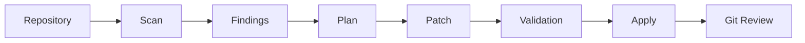

# PatchForge

[](https://github.com/Argenis1412/PatchForge/actions)
[](https://opensource.org/licenses/MIT)
[](https://www.python.org/downloads/)


PatchForge is a Git-native refactoring engine for real repositories: generate,
validate, and apply reviewable code patches safely.

## Philosophy

PatchForge is built around a simple principle:

> AI proposes. PatchForge proves. Humans decide.

See:
- [Product Thesis](./docs/product-thesis-v2.md) — Why PatchForge exists, its principles, and competitive moat.
- [ADR-0003: Product Contract](./docs/adr/ADR-0003-product-contract.md) — The binding repository safety contract and patch lifecycle.

## Why PatchForge Exists

Most AI coding tools optimize for speed.

PatchForge optimizes for trust.

Instead of modifying repositories immediately, PatchForge separates:

```text
Scan → Plan → Patch → Validation → Apply
```

Every change remains reviewable before repository modification.

The long-term product workflow is intentionally simple:

```bash
patchforge doctor .
patchforge scan .
patchforge plan .
patchforge preview .
patchforge apply run_001
```

The internal runtime may use specialized agents, typed Pydantic contracts, checkpoints, model
routing, and structured observability. Those are implementation details. The user-facing product is
organized around repositories, plans, patches, validation, and Git review.

## Repository Safety Contract

PatchForge SHALL NOT modify repository contents unless:

1. A patch exists.
2. Validation succeeded.
3. Repository state is compatible.
4. User explicitly executes `apply`.

Current implementation caveat: today, the default workspace is created under the target repository
(`./workspace`). That means `patchforge scan ./your-project` may write orchestrator artifacts inside
the target working tree before `apply` is available. Until the workspace redesign lands, pass an external
workspace path when you want strict no-target-write behavior:

```bash
patchforge scan ./your-project --workspace /tmp/patchforge-workspace
```

The product contract means:

- `doctor` checks repository and environment readiness.
- `scan` analyzes the repository and writes findings as artifacts.
- `plan` proposes bounded tasks without generating or applying changes.
- `preview` generates a patch artifact and validation report without touching the working tree.
- `apply` is the only command allowed to modify the repository, and it must do so through Git safety checks.

See [ADR-0003: Product Contract — Reviewable Patch Workflow](./docs/adr/ADR-0003-product-contract.md)
for the binding product direction and patch lifecycle.

## What Makes PatchForge Different?

Most tools focus on autonomous code generation.

PatchForge focuses on repository safety.

| Tool | Primary Goal |
|------|-------------|
| Aider | Fast iteration |
| OpenHands | Autonomous execution |
| Plandex | Large-context planning |
| **PatchForge** | **Reviewable, auditable patches** |

See the [Product Thesis](./docs/product-thesis-v2.md) for a detailed competitive analysis.

## Target Architecture



A mature run should produce a self-contained artifact tree:

```text
workspace/
└── runs/
    └── run_001/
        ├── run.json
        ├── findings.json
        ├── plan.json
        ├── patch.diff
        ├── validation.json
        └── events.jsonl
```

The patch is the unit of value. A successful run is not “all agents completed”; it is a reviewable
patch, successful validation, and explicit human approval before repository modification.

## Current Status

- V1 complete: 5 commands (`doctor`, `scan`, `plan`, `preview`, `apply`).
- Current phase: P2 Dogfooding & Hardening.
- QA: pytest 481 passed, 2 skipped | ruff 0 errors.
- See the [Phase 2 Roadmap](./docs/planning/roadmap-phase2.md) for current priorities.

## Quickstart

```bash
git clone https://github.com/Argenis1412/PatchForge.git
cd PatchForge
pip install -e .

# Current available analysis command. Use an external workspace to avoid
# writing orchestrator artifacts under ./your-project/workspace.
patchforge scan ./your-project --workspace /tmp/patchforge-workspace
```

## Why this direction?

Most agent frameworks expose internal orchestration as the product. PatchForge takes the
opposite approach: the runtime can be agentic internally, but the product should feel like a normal
engineering tool.

The design goals are:

- **Git-native safety** — changes are reviewable with normal Git commands.
- **Artifacts over magic** — findings, plans, patches, and validation reports are persisted.
- **Contracts over prompts** — internal stages communicate through typed schemas.
- **Small reliable changes** — bounded refactors beat broad unreliable automation.
- **Human approval** — repository modification happens only at `apply`.

## Non-goals

PatchForge is **NOT**:

- A general-purpose agent framework.
- A chatbot or conversational IDE.
- A migration engine for framework major versions.
- A CI review bot.
- A monorepo platform.
- A Terraform/infrastructure automation tool.
- A no-code automation tool.

These may be explored later only after the Git-native patch workflow is reliable.

## Repository Structure

```text
src/
└── orchestrator/
    ├── main.py                # CLI entry point
    ├── pipeline.py            # Pipeline execution engine
    ├── doctor.py              # Readiness checks
    ├── git.py                 # Git operations
    ├── lifecycle.py           # Patch lifecycle state machine
    ├── risk.py                # Risk gates
    ├── circuit_breaker.py     # Per-provider circuit breaker
    ├── workspace.py           # Workspace management
    ├── agents/                # Scout, Architect, Executor, Validator
    ├── clients/               # LLM provider clients
    ├── commands/              # CLI commands (scan, plan, preview)
    ├── integrations/          # External tool integrations
    ├── llm/                   # LLM routing
    ├── observability/         # Structured logging & telemetry
    ├── scanners/              # Repository scanners
    └── schemas/               # Typed contracts (Pydantic models)
tests/
docs/
```

## Development

```bash
pip install -e ".[dev]"
pytest -v
ruff check src/
```

For more details, see the [documentation](./docs/index.md).
